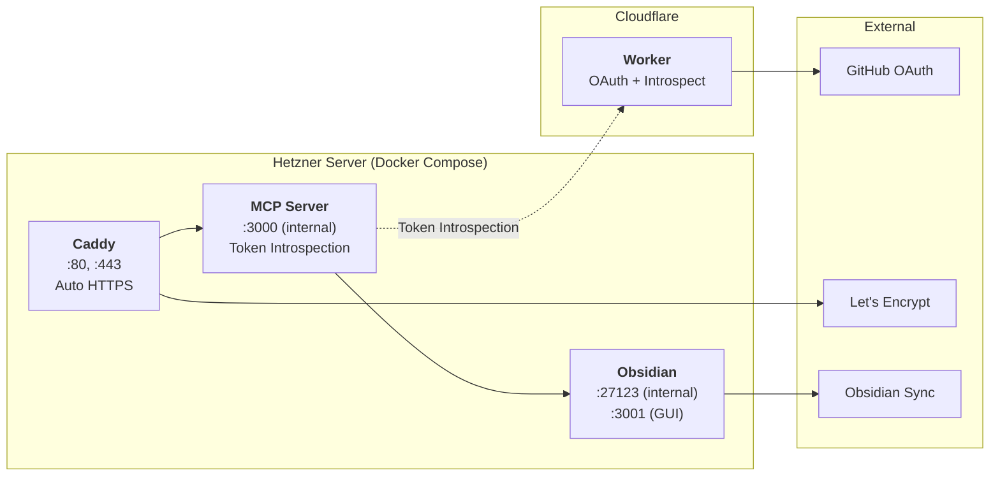
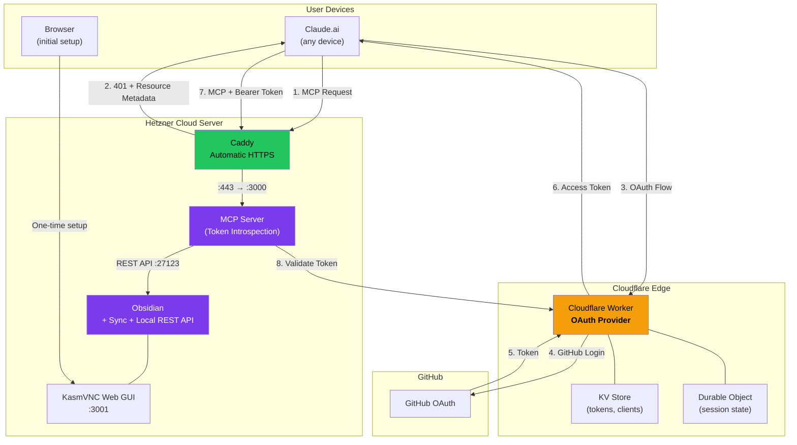
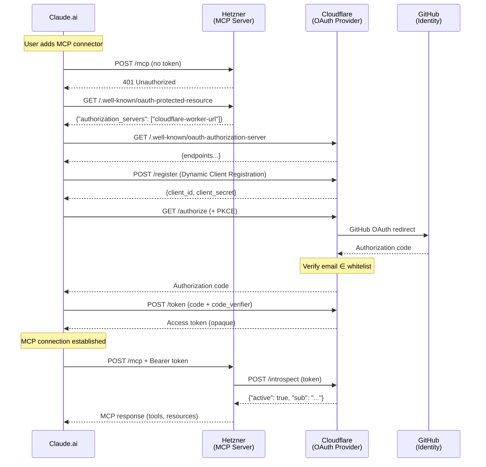

# Obsidian Cloud MCP

[](https://github.com/trieloff/vibe-coded-badge-action)

Deploy an Obsidian MCP Server in the cloud with Sync support. Access your vault from Claude.ai on any device, including mobile.

## What is this?

This repository provides Infrastructure-as-Code to deploy a cloud-based [Obsidian](https://obsidian.md) instance with an [MCP](https://modelcontextprotocol.io/) (Model Context Protocol) server. This allows AI assistants like Claude to read and write your Obsidian vault from anywhere.

**The Problem:** Obsidian runs locally, so AI assistants can't access your vault when you're on mobile or using cloud-based AI interfaces like Claude.ai.

**The Solution:** Run Obsidian in the cloud with Sync enabled, and expose it via an OAuth-protected MCP server.

## Architecture

The system consists of two main components: a **Hetzner cloud server** running Obsidian and the MCP server, and a **Cloudflare Worker** handling OAuth authentication.



### Detailed Component View



### Authentication Flow (RFC 7662 Token Introspection)

The MCP server and OAuth server are on separate hosts. Claude.ai discovers the OAuth server via [Protected Resource Metadata (RFC 9728)](https://datatracker.ietf.org/doc/html/rfc9728), then authenticates via GitHub OAuth on Cloudflare. The Hetzner MCP server validates tokens by calling Cloudflare's introspection endpoint.



## Important Limitations

> **Manual steps required after deployment.** Infrastructure deployment, HTTPS, and OAuth are fully automated, but two things need manual setup via the Web GUI:

1. **Obsidian Sync login** — There is no headless CLI authentication for Obsidian Sync. You must log in once via the Web GUI.
2. **Local REST API plugin** — The MCP server communicates with Obsidian via the [Local REST API](https://github.com/coddingtonbear/obsidian-local-rest-api) community plugin. You must install and configure it manually:
   - Open Obsidian Settings (in the Web GUI)
   - Go to **Community plugins** → Browse → Search for **"Local REST API"**
   - Install and enable the plugin
   - Go to **Settings → Local REST API**:
     - Enable **"Bind to all network interfaces"** (required for Docker networking)
     - Copy the **API Key** shown in the plugin settings
   - Run the **"Configure API Key"** GitHub workflow with the copied key

After both steps are done, Sync and the MCP server run automatically.

## Prerequisites

1. **Hetzner Cloud Account** — [Sign up here](https://console.hetzner.cloud/)
2. **Obsidian Sync License** — [Get it here](https://obsidian.md/sync)
3. **GitHub Account** — For OAuth identity provider
4. **Cloudflare Account** — [Sign up here](https://dash.cloudflare.com/sign-up) (free tier works)
5. **Domain Name** — For HTTPS (subdomain works, e.g., `mcp.yourdomain.com`)
6. **SSH Key Pair** — For server access

## Quick Start

### Step 1: Cloudflare Worker Setup

The Cloudflare Worker acts as OAuth provider for Claude.ai.

1. **Create a GitHub OAuth App:**
   - Go to [GitHub → Settings → Developer settings → OAuth Apps](https://github.com/settings/developers)
   - **Authorization callback URL:** `https://<your-worker>.workers.dev/callback`
   - Note the **Client ID** and **Client Secret**

2. **Deploy the Worker:**
   ```bash
   cd cloudflare-mcp-server
   npm install
   npx wrangler login

   # Create KV namespace
   npx wrangler kv namespace create OAUTH_KV

   # Update wrangler.jsonc with the KV namespace ID

   # Set secrets
   npx wrangler secret put GITHUB_CLIENT_ID
   npx wrangler secret put GITHUB_CLIENT_SECRET
   npx wrangler secret put COOKIE_ENCRYPTION_KEY  # openssl rand -base64 32

   # Deploy
   npx wrangler deploy
   ```

3. **Update GitHub OAuth App** callback URL with the deployed worker URL.

### Step 2: DNS Setup

Create an A record pointing your domain to your server IP:

| Type | Name | Value |
|------|------|-------|
| A | `mcp` | `<your-server-ip>` |

(You'll get the IP after deployment — update DNS then.)

### Step 3: GitHub Secrets

Add these secrets to your forked repository:

| Secret | Description |
|--------|-------------|
| `HCLOUD_TOKEN` | Hetzner Cloud API token |
| `SSH_PUBLIC_KEY` | Your SSH public key |
| `SSH_PRIVATE_KEY` | Your SSH private key |
| `VNC_PASSWORD` | Password for Web GUI access |

### Step 4: Deploy Hetzner Server

1. Go to **Actions** → **Deploy Infrastructure** → **Run workflow**
2. Enter your domain (e.g., `mcp.yourdomain.com`)
3. Wait 3–5 minutes for deployment + SSL certificate

### Step 5: Configure Obsidian

1. **Update DNS** with the server IP from the workflow output
2. **Open Web GUI**: `https://<server-ip>:3001`
   - Username: `admin`
   - Password: Your `VNC_PASSWORD`
3. **Log in to Obsidian Sync** in the GUI
4. **Install and configure the "Local REST API" plugin:**
   - Go to **Settings → Community plugins → Browse**
   - Search for **"Local REST API"** and install it
   - Enable the plugin
   - Go to **Settings → Local REST API**:
     - Enable **"Bind to all network interfaces"**
     - Copy the **API Key**
5. **Run "Configure API Key" workflow** with the copied key

### Step 6: Configure Claude.ai

In Claude.ai settings, add a custom MCP connector:

| Field | Value |
|-------|-------|
| **Server URL** | `https://mcp.yourdomain.com/mcp` |

Claude.ai will automatically:
1. Discover the OAuth server via Protected Resource Metadata
2. Redirect you to GitHub for login
3. Establish the MCP connection after successful auth

### Step 7: Disable Web GUI

After initial setup, disable the Web GUI for better security:

- Go to **Actions** → **Toggle Web GUI Access** → **disable**

## Email Whitelist

Access is restricted by GitHub email. The allowed email is configured in:

```
cloudflare-mcp-server/src/github-handler.ts
```

```typescript
const ALLOWED_EMAILS = new Set<string>(["your-email@example.com"]);
```

## Components

### Hetzner Server

| Container | Purpose | Ports |
|-----------|---------|-------|
| **Caddy** | Reverse proxy, auto HTTPS | 80, 443 (public) |
| **MCP Server** | Obsidian MCP with Token Introspection | 3000 (internal) |
| **Obsidian** | Vault with Sync + Local REST API | 27123 (internal), 3001 (GUI) |

The MCP server uses [cyanheads/obsidian-mcp-server](https://github.com/cyanheads/obsidian-mcp-server) with [RFC 7662 Token Introspection](https://datatracker.ietf.org/doc/html/rfc7662) support.

### Cloudflare Worker

| Endpoint | Purpose |
|----------|---------|
| `/.well-known/oauth-authorization-server` | OAuth discovery (RFC 8414) |
| `/.well-known/oauth-protected-resource` | Resource metadata (RFC 9728) |
| `/authorize` | OAuth authorization |
| `/callback` | GitHub OAuth callback |
| `/token` | Token exchange |
| `/register` | Dynamic client registration (RFC 7591) |
| `/introspect` | Token introspection (RFC 7662) |

### MCP Server Environment

| Variable | Description |
|----------|-------------|
| `MCP_AUTH_MODE` | `introspection` — validates tokens via remote endpoint |
| `TOKEN_INTROSPECTION_URL` | URL of the Cloudflare `/introspect` endpoint |
| `OBSIDIAN_API_KEY` | Local REST API plugin key |
| `OBSIDIAN_BASE_URL` | Internal Obsidian URL (`http://obsidian:27123`) |
| `MCP_TRANSPORT_TYPE` | `http` — Streamable HTTP transport |

## GitHub Workflows

| Workflow | Description |
|----------|-------------|
| **Deploy Infrastructure** | Creates Hetzner server with Obsidian + MCP + Caddy |
| **Configure API Key** | Sets the REST API key on the server |
| **Toggle Web GUI Access** | Enable/disable GUI port via `DOCKER-USER` iptables chain |
| **Update Docker Images** | Pulls latest images and restarts containers |
| **Destroy Infrastructure** | Removes all Hetzner resources (type "DESTROY" to confirm) |

## Configuration

| Variable | Description | Default |
|----------|-------------|---------|
| `server_type` | Hetzner server type | `cx23` |
| `server_location` | Server location | `nbg1` |
| `enable_ipv4` | Enable IPv4 (+€0.50/month) | `true` |

### Server Types

| Type | Specs | Monthly Cost |
|------|-------|--------------|
| `cx23` | 2 vCPU, 4 GB RAM | ~€3.56 |
| `cx33` | 4 vCPU, 8 GB RAM | ~€5.94 |

## Costs

| Component | Monthly Cost |
|-----------|--------------|
| Hetzner cx23 Server | ~€3.56 |
| IPv4 Address | €0.50 |
| Cloudflare Worker | Free tier |
| Domain | ~€1 (if needed) |
| Obsidian Sync | $4–8 |
| **Total** | **~€8–12/month** |

## Security

### Authentication

| Layer | Method | Details |
|-------|--------|---------|
| MCP Server | OAuth 2.1 | Via Cloudflare Worker, tokens validated via RFC 7662 Introspection |
| OAuth Identity | GitHub OAuth | Email whitelist restricts access |
| Web GUI | Basic Auth | Username: `admin`, Password: `VNC_PASSWORD` |
| GUI Firewall | iptables | DOCKER-USER chain blocks port 3001 when disabled |

### HTTPS

- **Automatic certificates** via Let's Encrypt
- **Auto-renewal** handled by Caddy
- **No manual intervention** required

### Network

- **MCP only via HTTPS** — Port 443 via Caddy
- **REST API internal only** — Port 27123 not exposed externally
- **Web GUI restricted** — Can be disabled when not needed
- **Firewall rules** — Only necessary ports open (22, 80, 443)

## Troubleshooting

**SSL certificate not working:**
- Ensure DNS A record points to correct IP
- Wait 5 minutes for certificate issuance
- Check Caddy logs: `docker logs caddy`

**MCP server returning 401:**
- Token introspection might be failing
- Check MCP logs: `docker logs obsidian-mcp`
- Verify Cloudflare Worker is deployed and `/introspect` endpoint works

**OAuth redirect errors:**
- Verify GitHub OAuth App callback URL matches worker URL
- Check email whitelist in `github-handler.ts`

**Web GUI not accessible:**
- Check if DOCKER-USER iptables rule is blocking: `iptables -L DOCKER-USER -n`
- Run Toggle Web GUI workflow with "enable"

## Cleanup

To destroy all infrastructure:

```bash
# Via GitHub Actions (recommended)
# Actions → Destroy Infrastructure → type "DESTROY"

# Or via Terraform
cd terraform
terraform destroy
```

## Repository Structure

```
obsidian-cloud-mcp/
├── cloudflare-mcp-server/   # Cloudflare Worker (OAuth + Introspection)
│   ├── src/
│   │   ├── index.ts           # MCP proxy + OAuthProvider
│   │   ├── github-handler.ts  # GitHub OAuth + email whitelist + /introspect
│   │   ├── utils.ts           # OAuth helpers
│   │   └── workers-oauth-utils.ts  # CSRF, state management
│   └── wrangler.jsonc         # Cloudflare config
├── docker/                    # Docker Compose for Hetzner
│   ├── docker-compose.yml
│   ├── Caddyfile
│   └── .env.example
├── mcp-server/                # MCP server Dockerfile
│   └── Dockerfile
├── scripts/
│   ├── cloud-init.yml         # Server provisioning
│   ├── setup-mcp.sh           # Manual setup alternative
│   └── health-check.sh        # Health monitoring
├── .github/workflows/
│   ├── deploy.yml             # Deploy Hetzner infrastructure
│   ├── configure-api-key.yml  # Set Obsidian API key
│   ├── toggle-gui.yml         # Enable/disable Web GUI
│   ├── update.yml             # Update Docker images
│   └── destroy.yml            # Destroy infrastructure
└── terraform/                 # Hetzner IaC
```

## License

Apache 2.0 — see [LICENSE](LICENSE)
